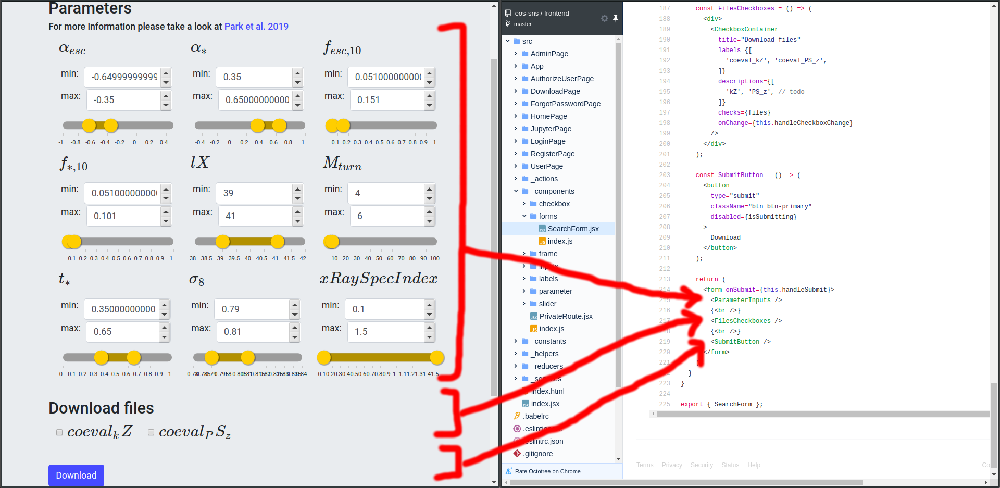
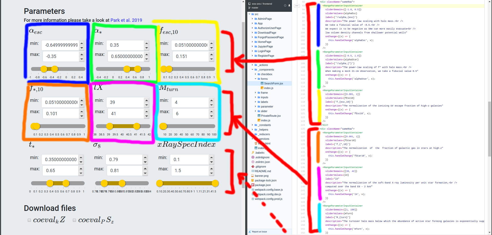

<h1>EOS | Dev Guide</h1>
<em>Warning: the code line numbers refer to the latest code pushed in GitHub at the moment of writing (29.10.2019)</em>  

## A note on notation

- `something written like this` is a piece of code, e.g `print('hello, world')`
- *something written like this* is a piece of architecture, e.g *backend*
- **something written like this** is a important, e.g **mind the gap**

## Current flow of information

**tl;dr**: user -> *frontend* -> *backend* -> *mercurius* -> *helios* -> data

### *frontend*
See how the code mirrors exactly the web-page:

[`FilesCheckboxes`](https://github.com/eos-sns/frontend/blob/master/src/_components/forms/SearchForm.jsx#L187) is a [ReactJs component](https://reactjs.org/docs/components-and-props.html) which has `'coeval_kZ', 'coeval_PS_z'` labels. Every time the user interacts with it, it calls [`this.handleCheckboxChange`](https://github.com/eos-sns/frontend/blob/master/src/_components/forms/SearchForm.jsx#L39) which updates the ReactJs component state with the new 'files'.

When a user submits the search, the `searchParams` are encoded in [`postSearch`](https://github.com/eos-sns/frontend/blob/master/src/_services/search.service.js#L10); then the data is transferred to *backend*.

### *backend*
[`searchByParams`](https://github.com/eos-sns/backend/blob/master/search/search.service.js#L12) will forward the request to *mercurius*, the local Flask server that handles the queries. The search request is a *POST* request: it is handled by [`handle_post_request`](https://github.com/eos-sns/mercurius/blob/master/mercurius/server.py#L16) which parses [user, parameters and files](https://github.com/eos-sns/mercurius/blob/master/mercurius/req/handlers.py#L118).

### *mercurius*
*mercurius* then creates an istance of `Helios` inside [`handle_query`](https://github.com/eos-sns/mercurius/blob/master/mercurius/req/handlers.py#L83) to handle the query. `helios` then saves to disk the data [with the required files](https://github.com/eos-sns/helios/blob/master/helios/helios/h5.py#L53).

*mercurius* uses 2 maps (i.e [`USER_FILES2MONGO`](https://github.com/eos-sns/mercurius/blob/master/mercurius/req/handlers.py#L32) and [`USER_PARAMS2MONGO`](https://github.com/eos-sns/mercurius/blob/master/mercurius/req/handlers.py#L21)) to translate from *frontend* request to actual data attributes in the database.

## Change of 'files checkboxes'

### *frontend*

- **change the [initial state](https://github.com/eos-sns/frontend/blob/master/src/_components/forms/SearchForm.jsx#L23)**.
- add a `label` (and its description) to add a file.

### *mercurius*

**Change [`USER_FILES2MONGO`](https://github.com/eos-sns/mercurius/blob/master/mercurius/req/handlers.py#L32) to tell *mercurius* what are the `files_to_get`**

## Change of 'params'

### *frontend*

- **change the [initial state](https://github.com/eos-sns/frontend/blob/master/src/_components/forms/SearchForm.jsx#L13)**
- provide [`getDataToSubmit`](https://github.com/eos-sns/frontend/blob/master/src/_components/forms/SearchForm.jsx#L43) with the new parameters
- [`render`](https://github.com/eos-sns/frontend/blob/master/src/_components/forms/SearchForm.jsx#L74) wiht the new parameters
- set the proper `sliderDomain` (i.e range), `label` (i.e name), `sliderValues` (i.e variable referred) and description for each [`RangeInputContainer`](https://github.com/eos-sns/frontend/blob/master/src/_components/forms/SearchForm.jsx#L93)

### *mercurius*

**Change [`USER_PARAMS2MONGO`](https://github.com/eos-sns/mercurius/blob/master/mercurius/req/handlers.py#L21) to tell *mercurius* what are the `parameters`**

## Authors
|  |
|---|
| [Stefano Fogarollo](https://sirfoga.github.io) |

## License
[Unlicense](https://unlicense.org/)
